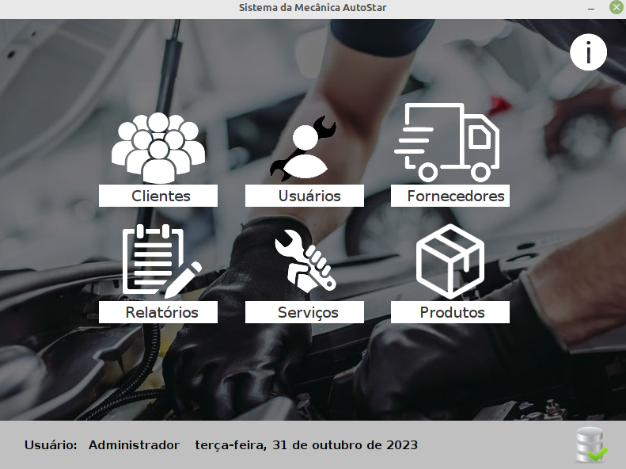

# GestaoCarMech
### Este programa é um sistema para gestão de uma mecanica e loja (**Sistema OS**) de uma mecanica de manutenção de veiculos e loja .  Este projeto é muito popular e serve como modelo para outros projetos de gestão de serviços, como por exemplo lojas de equipamentos automotivos, eletrodomésticos, oficinas mecânicas etc.

### Autor
Ryan Victor Ferreira Souto
### Apresentação do projeto

### Referência do projeto
Professor José de Assis

## Instalação da versão de demontração (projeto modelo)
Essas instruções fornecerão uma cópia do projeto instalado e funcionando em sua máquina local (Windows) para fins de desenvolvimento e testes. 
você também pode usar uma maquina virtual linux como banco de dados mysql nesta aplicação.
### Pré requisitos:
É necessário ter instalado no computador:
* Java JDK 8
* XAMPP Control v3.3.0
### Instalação:
* Execute o banco de dados MySQL (localhost) como root sem nenhuma senha definida (senha em branco)
* Crie um novo banco de dados de nome dbsistema
* Faça a importação do DUMP deste projeto (pasta banco) selecionando o banco de dados dbsistema
* Em "Releases" Faça o download do instalador targetos
* Execute a instalação. Na tela de login faça a autenticação com o usuário "admin" usando a senha "admin"

